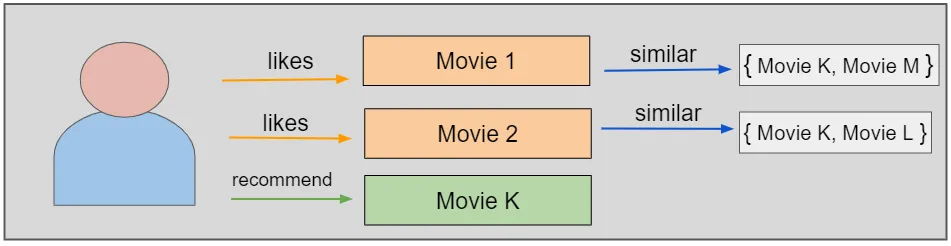
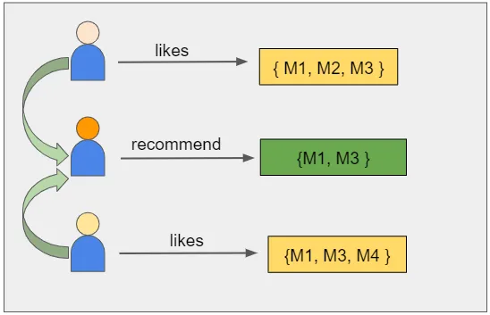

# Data-Sourcing-Challenge

I worked with a LA on AskBSC-308443, 308584, 308614, tutor Mohammed Fauwaaz in a Tutor Session on BCS and ChatGPT to complete this assignment.

## Overview
Prepare data for a recommendation system to help people find movie reviews and related movies. Extract data from The New York Times API and The Movie Database, then merge the data together. Keep in mind, the text extracted from these APIs can later be used with natural language processing methods.

## Purpose

## Business Advantage [^1]

## Landscape

## Results

### Part 1
1. The base URL is included in started code, along with the search string and query dates. Consult the NYT Article Search API documentation to help build "query_url" using the variables.

2. Create an empty list called "review_list" to store the reviews you retrieve from the API.

3. To bypass the Article Search API limiit of 10 per page (need to retrieve 200) create a "for" loop to loop through 20 pages (starting from page 0). Peform the following actions inside the loop:
  - Extend the "query_url" created in Step 1 to include the "page" parameter
  - Make a "GET" request to retrieve the page of results, and store the JSON data in a variable called "reviews."
  - Add a 12-second interval between queries to stay within API query limits. (NYT limits requests to 500 per day     and 5 per minute.
  - Write a try-except clause that performs the following actions:
    * "try": loop through the "reviews['respone']['docs'] and append each review to the list, then print out the      query page number (i.e. the number of times the loop has executed).
    * "except": Print the page number that had no results then break from the loop. (If your loop breaks at the
      "except" clause, it is possilbe you have to make a request that fell outside of the rate limit. You should         be able to loop through all 20 pages with the provided query parameterss

4.  Preview the first five results in JSON format using "json.dumps" with the argument "indent=4" to format the data.

5. Convervt "review_list" to a Pandas DataFrame using "json_normalize()"

6. Extract the movie title from the "headline.main" column and save it to a new column "title" using the Pandas apply() method and the following lambda function: lambda st: st[st.find("\u2018")+1:st.find("\u2019 Review")].
This code with take the string in the cell and extract the characters between the unicode quotation marks, as long as a space and the word "Review" follows the closing quotation mark.
7.  Use the supplied "extract_keywords" function to convert the "keywords" column from a list of dictionaries to strings using the apply() method.
8.  Create a list called titles from the "title" column using the "to_list()". These titles will be used in the query for The Movie Database.

### Part 2
Consult the Search & Query for Details documentation to build your query URLs in order to make both types of requests to extract all the details needed:
- The search query used to find the movie ID from the search by title. Most of this query is included in the starter code. All that needs to be added to the query is the movie title. The movie query is made once you have the movie ID.

Use the "titles" list created in Part 1 to perform queries with The Movie Database through the following steps:
1.  Create an empty list called "tmdb_movies_list" to store the results ffom your API requests. This will contain a list of dictionaries.

2.  Create a variable called request_counter and initialize it with the value of "1". This counter should do the following:
  - Increment by one every time you iterate through the "titles" list
  - Use "time.sleep()" when it reaches a multipe of 50.
  - Print a message to indicate that the application is sleeping.

3.  Loop through the titles list created from the movie reviews DataFrame, and perform the following actions:
  - Perform the actions outline in Step 2
  - Peform a "GET" request that sends the title to The Movie Database search and retrieves the JSON results.
  - Use a "try" clause that performs the following actions:
    * Collect the movie ID from the first result.
    * Make a "GET" request using the movie query (starting with https://api.themoviedb.org/3/movie/) and movie ID to retrieve the full movie details in JSON format.
    * Extract the genre names from the results into a list called "genres".
    * Extract the "spoken_languages" English name from the results into a list called "spoken_languages".
    * Extract the "production_countries" name from the results into a list called "production_countries".
    * Create a dictionary with the following results: "title", "original_title", "budget", "original_language",
      "homepage", "overview", "popularity", "runtime", "revenue", "release date", "vote_average", "vote_count", "genre", "spoken_languages",                     "production_countries"
    * Append this dictionary to the tmdb_movie_list
    * Print out the name of the movie and a message to indicate that the title was found.
  - Use the except clause to print out a statement if a movie is not found.
4.  Preview the first five results in JSON format using "json.dumps" with the argument "indent=4" to format the data.
5.  Convert the results to a DataFrame called "tmdb_df" with "pd.DataFrame()". Because we don't have nested objects we don't need to use json_normalize().

### Part 3
The following steps were used to merge the two DataFrames created by the data collected from both APIs, clean the data, and export it for future use.
1.  Merge the TMDB and New York Times reviews DataFrame on the "title" column.
2.  To display all columns as strings without the list characters ([, [, ') the following actions were performed:
  - Create a list of columns that need fixing called "columns_to_fix"
  - Create a list of characters to remove called "characters_to_remove"
  - Loop through "columns_to_fix" and do the following:
    * Use "astype()" to convert the column to a string.
    * Loop through the "characters_to_remove" and use the Pandas "str.replace()" method to remove the character from the string.
3.  Delete any duplicate rows and reset the index
4.  Export data to a CSV file without the DataFrame's index.
  

## Recommendations

[^1]: https://towardsdatascience.com/how-to-build-a-movie-recommendation-system-67e321339109
